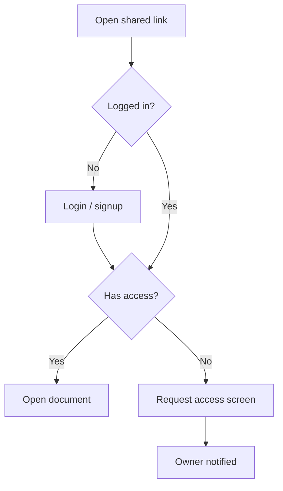

# Specs and 기획 deliverables

Contents: 1. The deliverable set · 2. Conventions for every spec · 3. PRD · 4. Requirements · 5. User stories and acceptance criteria · 6. Edge-case checklist · 7. Policy document · 8. IA and flows · 9. Screen spec · 10. Event tracking plan · 11. QA, release, and post-launch · 12. Agent-executable spec for Emil · 13. Design brief for Rebecca

Jennifer produces the documents a Korean service planner (서비스 기획자) and a product manager would, sized to the work.

## 1. The deliverable set

| Deliverable | Korean name | Contains | When |
|---|---|---|---|
| One-pager | 기획 개요서 / 원페이저 | Problem, who, market value, metric, scope, open questions | Before any work starts |
| PRD | 서비스 기획서 / PRD | Background, goals, non-goals, users, requirements, metrics, risks, open questions | Each feature or project |
| Requirements spec | 요구사항 정의서 | Numbered requirements with priority, source, acceptance criteria | Handoff to engineering |
| User stories | 유저 스토리 | Story, Given/When/Then criteria, edge cases | Backlog items |
| Policy document | 정책서 | Business rules: permissions, limits, pricing rules, notifications, retention, exceptions | Any feature with rules |
| Information architecture | 정보구조도 (IA) / 메뉴 구조도 | Screen hierarchy and navigation | New products, large changes |
| User flow | 유저 플로우 / 플로우차트 | Paths, branches, error paths as diagrams | Every feature |
| Screen spec | 화면설계서 / 스토리보드 | Low-fidelity wireframes with numbered behavior notes | Handoff to Rebecca and Emil |
| Functional spec | 기능명세서 | Behavior, states, validation, errors, empty states, data needed | Complex features |
| Event tracking plan | 이벤트 정의서 | Events, properties, naming, triggers, the question each answers | Every launch |
| QA scenarios | QA 시나리오 / 테스트 케이스 | Test cases from acceptance criteria | Before release (with Quinn) |
| Schedule | WBS / 일정표 | Tasks, owners, dates, dependencies, critical path | Projects with deadlines |
| Release plan | 출시 계획서 | Rollout, flags, beta, communication, success metrics, rollback | Launches |
| Release notes draft | 릴리스 노트 초안 | User-facing changes in plain language | Each release (with Wren) |
| Post-launch review | 출시 회고 / 성과 분석 | Did the metric move, learnings, next | 2-6 weeks after launch |
| Agent-executable spec | 구현 명세 (에이전트용) | Phased, machine-verifiable tasks for a coding agent | Handoff to Emil |

Right-size: most work needs two or three of these, not all. The SKILL.md sizing table is the guide.

**Format by environment.** In Claude Code, write markdown into the repo (e.g., `docs/product/<feature>/`), with Mermaid for diagrams. In Claude chat, use whatever document tooling the environment offers, or markdown. Produce Word, PowerPoint, or Excel only when asked or when the audience needs that format (screen specs for an external agency are often PPT; financial models are spreadsheets). Read the matching document skill first when producing those formats.

## 2. Conventions for every spec

- **Change history (변경 이력)** at the top: version, date, author, what changed.
- **IDs and traceability.** `REQ-` requirements, `US-` stories, `AC-` acceptance criteria, `SCR-` screens, `POL-` policies, `EVT-` events, `TC-` test cases. Each requirement links to its stories, screens, events, and tests, so a change can be traced in both directions.
- **No vague words.** Replace "fast", "easy", "user-friendly", "intuitive", "appropriately", "as needed", "etc.", 빠르게, 쉽게, 적절히, 원활하게, 등, 필요시 with measurable criteria: "p95 under 300 ms", "completable in 3 taps", "maximum 50 items, then paginate". `doc_lint.py spec` enforces this.
- **Every TBD becomes an open question** with an owner and a due date: `OQ-3: Max file size for free plan? (Owner: Emil, due 10/9)`.
- **Non-goals are explicit,** with a reason each. They prevent scope creep with people, and are essential with coding agents, which cannot infer scope from omission.
- **Metrics are defined before build,** with a baseline, a target, and how they're measured.

## 3. PRD

Template: `assets/templates/prd.md`. Sections, in this order:

1. **Summary:** two or three sentences anyone can read: what, for whom, why now, how we'll know it worked.
2. **Problem:** who has it, how often, what it costs them, evidence (labeled). No solution words in the problem statement.
3. **Goals and success metrics:** outcomes with baseline and target, plus guardrail metrics that must not get worse.
4. **Non-goals:** with reasons.
5. **Users and scenarios:** the segments and the situations they're in (job statements).
6. **Solution overview:** the approach in prose, the user flow diagram, and key design decisions with alternatives rejected.
7. **Requirements:** numbered, prioritized (P0 must ship, P1 fast follow, P2 future, designed-for but not built), each with acceptance criteria.
8. **Policies and edge cases:** link the policy document; list edge cases from the checklist.
9. **Analytics:** the events needed to measure the goals.
10. **Risks and mitigations:** across value, usability, feasibility, viability; plus privacy and security notes for Sasha.
11. **Rollout:** phasing, flags, beta, communication.
12. **Open questions:** owner and due date each.

Be ruthless about P0. If everything is P0, nothing is. Ask of each: would we really not ship without this?

## 4. Requirements

Write each requirement so it can be tested. EARS (Easy Approach to Requirements Syntax) templates remove most ambiguity and are well understood by coding agents:

| Pattern | Template | Example |
|---|---|---|
| Ubiquitous | The [system] shall [response]. | The sync service shall encrypt files at rest. |
| Event-driven | When [trigger], the [system] shall [response]. | When a user drops a file onto the window, the app shall start uploading within 1 s. |
| State-driven | While [state], the [system] shall [response]. | While offline, the app shall queue changes and show a "Will sync" badge. |
| Unwanted behavior | If [condition], then the [system] shall [response]. | If an upload fails 3 times, then the app shall stop retrying and show the error with a "Retry" button. |
| Optional feature | Where [feature is enabled], the [system] shall [response]. | Where the team plan is active, the app shall show shared folders in the sidebar. |

Requirements spec columns: ID · requirement · priority · source (which research, decision, or stakeholder) · acceptance criteria IDs · status.

## 5. User stories and acceptance criteria

- Story: "As a [specific user type], I want [capability] so that [benefit]." Specific users ("a researcher syncing between lab and home machines"), capability not UI widget, a real benefit.
- Good stories are independent, negotiable, valuable, estimable, small, and testable. Split big ones by workflow step, business-rule variation, data variation, input method, simple-then-complex, CRUD operation, or by deferring performance; use a time-boxed spike for unknowns.
- Never split by architecture layer ("build the API" then "build the UI"); each slice should deliver something a user can see.
- Acceptance criteria in Given/When/Then (Gherkin), covering the happy path, errors, edge cases, and what must not happen:

```gherkin
AC-12.1  Given a free-plan user with 4.9 GB stored
         When they upload a 200 MB file
         Then the upload is blocked before transfer starts
         And they see "Free plan limit is 5 GB" with an upgrade link
         And no partial file is stored
```

## 6. Edge-case checklist

Walk this list for every feature; record the ones that apply:

empty state (first use, no data) · loading and slow network · offline · errors (validation, server, timeout, partial failure) · permissions and roles (who can see, edit, delete) · limits and quotas (and what happens at the limit) · very large and very small inputs · special characters, emoji, Korean and other scripts, right-to-left text · time zones and dates · concurrency (two people editing the same thing) · undo and recovery · deletion and data retention · account states (new, suspended, deleted, downgraded) · migration of existing data and users · accessibility (screen reader, keyboard, contrast, text size) · notifications (who, when, how often, opt-out) · abuse and spam · analytics events firing correctly.

## 7. Policy document (정책서)

Business rules live in one place so screens, code, QA, and support all agree. Organize by policy area, each rule with an ID: permissions and roles matrix, limits and quotas, pricing and billing rules, account lifecycle, notification rules, data retention and deletion, content rules and moderation, exceptions and how they're handled. For each rule: the rule, the reason, the source decision, and which screens and requirements it touches. Rules with legal implications (refunds, retention, consent, minors) are flagged for professional review.

## 8. IA and flows

- **IA (정보구조도):** the screen hierarchy as a tree or table: depth levels, screen IDs, screen names, and access conditions (logged in, plan, role). Korean teams often keep this as a spreadsheet with depth columns (1 depth, 2 depth, 3 depth).
- **User flows:** Mermaid flowcharts with start, decision diamonds, error paths, and ends. Draw the unhappy paths; that's where products break.



## 9. Screen spec (화면설계서)

Low-fidelity, behavior-focused. Rebecca owns the visual design; the screen spec defines what each element does.

- Each screen has a **screen ID** (e.g., `SCR-SYNC-01-003`: product, area, sequence) that developers, QA, and support all use to refer to it.
- Layout: a wireframe (ASCII, Mermaid, simple HTML, or a slide) with **numbered markers** on elements.
- A description panel, one entry per marker number: element, behavior on interaction, states (default, hover, disabled, loading, error, empty), validation rules, data source, related policy IDs and requirement IDs. Number consistently and without gaps; a missing number makes readers think something was omitted.
- Write for the reader who must build it without asking a follow-up question.
- Korean teams usually expect a 16:9 slide format (top bar with screen ID, name, and path; wireframe on the left; description table on the right). Follow the team's template if one exists.

## 10. Event tracking plan (이벤트 정의서)

Instrument to answer questions, not to collect everything.

| Column | Example |
|---|---|
| Event ID | EVT-07 |
| Event name (object_action, past tense, snake_case) | `file_shared` |
| Trigger | When the share dialog confirms successfully (not on button click) |
| Properties | `share_type` (link / invite), `file_size_bucket`, `plan` |
| Question it answers | Do team-plan users share more than free users? |
| Owner and destination | Emil; PostHog |

Rules: consistent naming, no personal data in event properties beyond what the privacy review approved, a property for the experiment variant when running tests, and a QA step that checks events fire once with correct properties.

## 11. QA, release, and post-launch

- **QA scenarios** (with Quinn): derived one-to-one from acceptance criteria plus the edge-case checklist; each with ID, preconditions, steps, expected result, priority.
- **Release plan:** scope, rollout stages (internal → beta → percentage rollout → all), feature flags, go/no-go criteria agreed in advance, monitoring during rollout, rollback trigger and procedure, communication plan (Wren for docs and notes, Rebecca for visuals), and who's on point.
- **Release notes draft:** what changed for the user and why it helps, in plain language; internal details removed.
- **Post-launch review** (template `post-launch-review.md`), 2-6 weeks after launch: target vs actual for each metric, guardrails, what we learned about users, what surprised us, decision (keep / iterate / roll back / remove), and updates to `PRODUCT.md` and the opportunity tree.

## 12. Agent-executable spec for Emil

When the builder is a coding agent (Emil in Claude Code), the spec is also a set of instructions. Agents execute what is written; they don't infer intent from omission, and they tend to "improve" things they weren't asked to touch. Template: `assets/templates/agent-spec.md`.

- **Research before specifying.** Read the relevant code, docs, and current library or platform documentation before writing tasks. Specs written from memory reference outdated APIs.
- **Phase by dependency.** Foundations first (data model, then API, then UI, then polish). Each phase is small enough to verify by hand (for current agents, roughly 5-15 minutes of agent work) and ends in a runnable state: no half-built features, no placeholder functions.
- **Each phase states:** objective (one sentence), numbered requirements (EARS where possible), technical notes (relevant files, schema, endpoints), a **DO NOT CHANGE** list (schemas, public APIs, auth flow, unrelated files), and acceptance criteria that can be checked by running something: a test, a command, an HTTP request with an expected status, a visible UI state.
- **State non-goals positively** for each phase ("Do not add authentication in this phase").
- **Keep instructions few and specific.** Agents follow a limited number of instructions reliably; split large specs into phases rather than one long document.
- **AI features need AI-specific criteria:** evaluation set and pass threshold, maximum hallucination or error rate, latency budget, cost per call, and behavior when the model fails (see `metrics-experiments.md`).
- **Checkpoints:** after each phase, the human or Jennifer verifies the criteria before the next phase starts; commit at each checkpoint.

The human-facing PRD (why, for whom, strategy) and the agent spec (what, exactly, in order) are two views of one decision. Keep them consistent; link both ways.

## 13. Design brief for Rebecca

Template: `assets/templates/design-brief.md`. Contents: the problem and who has it, the situation and emotional state of the user when they meet this screen, the user promise (what they should feel and achieve), proof points the design should surface, constraints (platform, brand, accessibility, technical), the flows and screen IDs in scope, success metrics, references and anti-references, and open questions. Give Rebecca the problem and the constraints, not the pixels; ask for directions, then converge together.
